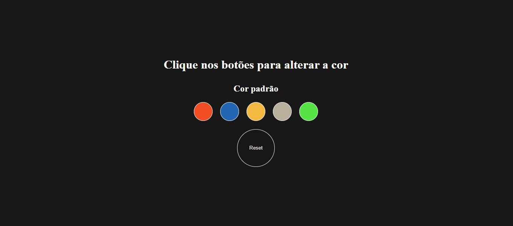
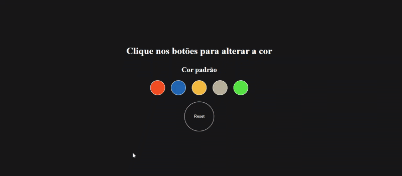

# Altera fundo

 
 

https://github.com/user-attachments/assets/73aed4d5-40d5-4f67-a713-74913b7e08e6

## 🤔 O que é este projeto
Este projeto é uma página feita com HTML, CSS, e Javascript que contém uma série
de botões coloridos, para que a pessoa que esteja utilizando a aplicação possa alterar 
a cor de fundo da página.

## 💻 Como rodar este projeto
para rodar este projeto basta dar dois cliques no arquivo **index.html** uma vez que a pasta do projeto esteja aberta no sistema de arquivos do seu sistema operacional.

Alternativamente, voce também pode utilizar a extensão [Live Server](https://marketplace.visualstudio.com/items?itemName=ritwickdey.LiveServer) da IDE Visual Studio Code para rodar o projeto.

## 🕹️ Como usar o projeto
Uma vez que a aplicaçao esteja rodando, voce pode clicar nos circulos coloridos que são mostrados na página para alterar a cor de fundo da pagina. A cor será alterda em função do botão que voce precionar.

## ⚙️ Tecnologias utilizadas
- HTML
- CSS
- Javascript

## 🗒️ Features do projeto
- 5 botões com cores diferentes, que alteram a cor de fundo da pagina
- 1 botão para resetar a cor padrão da tela
- subtítulo que é atualizado de acordo com a cor atual da página

## 📁 Como este projeto está organizado
- index.html -> contém o html da aplicação
- style.css -> contém os estilos da aplicação
- script.js -> contém o código javascript da aplicação

## 🧑‍💻 Como o projeto foi implementado
ao clicar em um botão,é disparado um evento que irá alterar a cor de fundo da página e o título de segunda importancia será atualizado com o código da cor que está armazenada em um array

## ⭐ Dependencias Principais
não temos dependencias no projeto

## 💎 Links úteis
- [Paleta de cores](https://paletadecores.com/)

## 🤝 Como contribuir com o projeto
[click aqui](./CONTRIBUTING.md) para ver as diretrizes de contribuição.

## 👨‍💻 Contribuintes do projeto
- [Yoanny](https://github.com/yoanny2023) -> Coordenador do projeto
- [Kubanza](https://github.com/yoanny2023) -> Contribuinte
- [Leonardo](https://github.com/yoanny2023) -> Contribuinte

## 🆘 Precisa de ajuda?
voce pode contactar Yoanny *coordenador do projeto* em email2025@ymail.com

 

